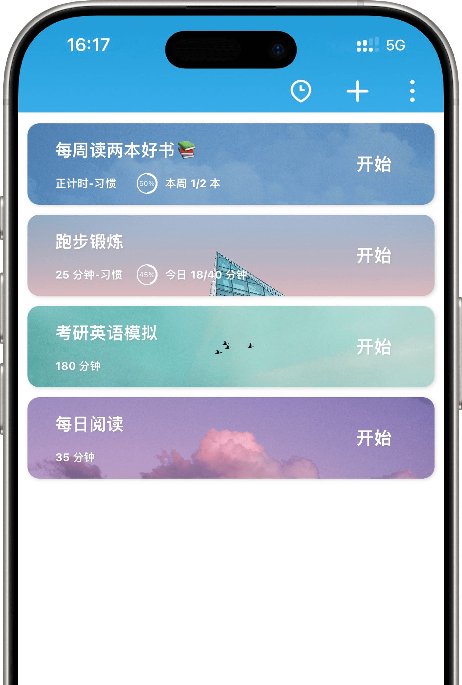
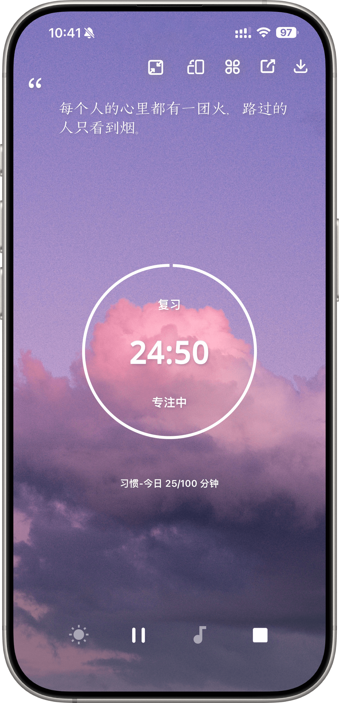

# App页面结构整理

## 核心目标
这个应用的核心目标是追踪用户的习惯，记录用户在每个习惯上花费的时间。

## 全局功能要求
### 通知功能
- 如果用户打开了软件中的通知开关，并且用户设置了习惯的目标，那么会每周，每月，每年，发送一次通知
- 通知内容包含用户习惯的进度情况，以及相比之前几个周期的变化情况

### 系统美化
- 整个系统的背景允许自定义，用户可以选择自己喜欢的背景颜色，允许用户使用自定义图片
- 支持用户自定义字体，用户可以选择自己喜欢的字体，并且可以在应用中使用
- 支持用户自定义图标，用户可以选择自己喜欢的图标，并且可以在应用中使用

### 系统安全
- 所有数据默认加密保存
- 支持用户备份数据，通过 webDav 备份数据
- 支持用户恢复数据，通过 webDav 恢复数据
- 支持用户导出数据，导出的数据按照 json 存储

## 页面结构
整个 App 最下方有多个 Tab，通过 Tab 切换到不同的页面。

### 1. 习惯Tab

#### 页面元素与功能
- **习惯卡片**：
  - 长条状设计，有图片背景（在「新建习惯页面」指定）
  - 左上角是大写字体高亮的习惯名称，支持 emoji 等图标
  - 如果当前习惯设置了目标，名称下方显示目标值和环形完成百分比
  - 最右端是开始按钮（点击后弹出「专注选择页面」）；如果习惯未设置追踪时间，则显示打卡字样
  - 左滑卡片会出现删除字样，弹出确认删除界面

- **操作按钮**：
  - 最右下方+号图标：点击后进入「新建习惯页面」
  - 右上角按钮：点击后进入「补充打卡页面」
    - 补充打卡页面可选择习惯
    - 如果习惯设置了追踪时间，显示填写追踪时间的输入框

- **交互**：
  - 长按卡片弹出「新建习惯页面」（实际为修改功能）

#### 1.1 新建习惯页面
- **习惯名称**：输入框

- **背景图片**：
  - 从现有图片库选择
  - 使用本地图片

- **习惯周期与目标**：
  - 多选框选择周期类型
  - 每个选择可设置正向或负向目标
  - 目标支持次数和时间

- **周期选项**：
  - 固定时间：显示一至七的选择框（代表每周一至周日）
  - 每周：数字框（表示每周多少天需要完成目标）
  - 每月：数字框（表示每月多少天需要完成目标）
  - 每隔几天：数字框（表示每隔几天需要完成目标）

#### 1.2 专注选择页面
- **专注模型**：
  - 正计时：时钟选项，从0开始计时，允许更换时钟样式
  - 倒计时：时钟选项，用户可上下滑动修改时间
  - 番茄钟：时钟选项，调节一轮时间
    - 设置按钮：用于设置番茄钟的休息间隔、次数等

- **开始按钮**：最下方，点击后进入「专注页面」

#### 1.3 专注页面

- **时钟显示**：根据选择的专注类型展示
- **时钟样式**：支持更换
- **操作按钮**：
  - 暂停/恢复按钮
  - 结束按钮：点击后保存追踪记录

- **附加功能**：
  - 支持自定义背景图片
  - 支持屏幕常亮
  - 默认点击进入全屏时钟页面，再点击一次返回

### 2. 统计Tab

#### 页面元素与功能
- **折线图**：
  - 按周、月、年追踪习惯的次数

- **饼状图**：
  - 按周、月、年展示每个习惯在追踪次数和时间的占比

- **习惯选择**：
  - 下滑选择习惯
  - 选择年月进行展示
    - 年：展示习惯的热力图
    - 月：显示日历展示用户当前月完成的习惯情况

- **日历组件**：
  - 按周或月进行切换
  - 在每一天上，展示已经完成的目标

## 数据结构要求
- 每个习惯包含：名称、图标、追踪次数、追踪天数
- 习惯可设置是否追踪时间
- 次数和天数可设置目标（正向/反向）